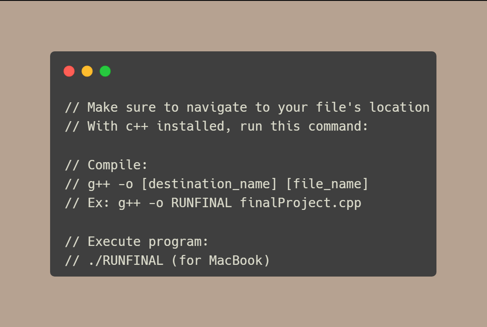
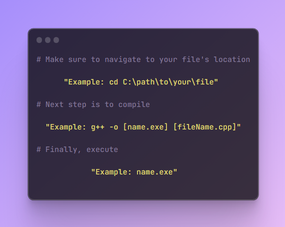

# TShirt Company Price Calculator
 This is a project that simulates a customer purchasing a set number of t-shirts, and calculating the price based on the characteristics of the t-shirts purchased. This demonstrates basic automation of straightforward tasks, problem solving, and a foundational understanding of the language's syntax, principles, and applications.

## Reference Image

As various characteristics are taken into account during the selection phase of your purchase, the price differs in respect to the choices selected.

Said characteristics are as follows:
- Number of colors printed on shirt
- Front or front and back side printed
- Number of shirts
- Shirt size
  
 

## How to Install and Execute
 - Download (finalProject.cpp) and (functions.cpp)
 - Once downloaded and open, run the following commands in your command prompt/terminal:

 

#### FOR MACBOOK/APPLE PRODUCTS:

 

#### FOR WINDOWS:

